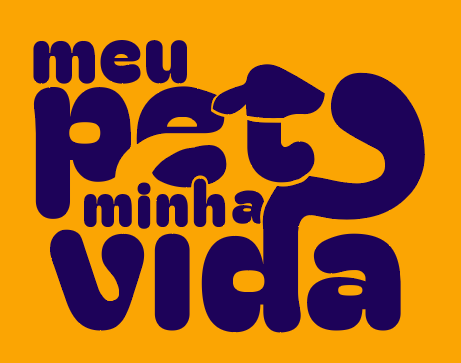
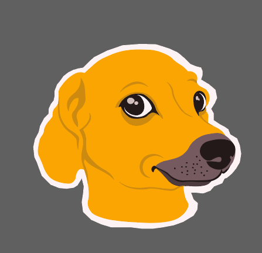

<a name="readme-top"></a>

[![Contributors][contributors-shield]][contributors-url]
[![Forks][forks-shield]][forks-url]
[![Stargazers][stars-shield]][stars-url]
[![Issues][issues-shield]][issues-url]
[![License][license-shield]][license-url]

<br />

<div align="center">
  <a href="https://github.com/otaldonuness/meupetminhavida-back">
    
  </a>

<h1 align="center">Meu Pet Minha Vida</h1>

  <p align="center">
    Esse é um projeto open source e tem como propósito aprimorar o processo de adoção de animais de estimação. A ideia é desenvolver um site que auxilie os bichinhos a encontrarem um dono(a) com a "combinação perfeita".
    <br />
    <a href="https://www.notion.so/meupet-minhavida/43afad71051c45f489007db1b2ed3549?v=60a7d4e130eb4bcd84210db7ec3ff109&pvs=4"><strong>Mais sobre o projeto »</strong></a>
    <br />
    <br />
    <!-- <a href="https://github.com/otaldonuness/meupetminhavida-back">View Demo</a>
    · -->
    <a href="https://github.com/otaldonuness/meupetminhavida-back/issues">Report Bug</a>
    ·
    <a href="https://github.com/otaldonuness/meupetminhavida-back/issues">Request Feature</a>
  </p>
</div>

---

<!-- TABLE OF CONTENTS -->
<details>
  <summary><b>Conteúdo</b1></summary>
  <ol>
    <li>
      <a href="#🎯-sobre-o-projeto">🎯 Sobre o projeto</a>
      <ul>
        <li><a href="#🔨-feito-com">🔨 Feito com</a></li>
      </ul>
    </li>
    <li>
      <a href="#🚀-comece-por-aqui">🚀 Comece por aqui</a>
      <ul>
        <li><a href="#🔍-pré-requisitos">🔍 Pré requisitos</a></li>
        <li><a href="#🔧-instalação">🔧 Instalação</a></li>
      </ul>
    </li>
    <li>
      <a href="#💻-desenvolvendo">💻 Desenvolvendo</a>
      <ul>
        <li><a href="#🧪-testando">🧪 Testando</a></li>
      </ul>
    </li>
    <li><a href="#🤝-contribuindo">🤝 Contribuindo</a></li>
    <li><a href="#📜-licença">📜 Licença</a></li>
    <li><a href="#📧-contato">📧 Contato</a></li>
  </ol>
</details>

---

## 🎯 Sobre o projeto

<div align="center">
  <a href="https://github.com/otaldonuness/meupetminhavida-back">
    
  </a>
</div>

Back-end do projeto **Meu Pet Minha Vida**, que é open source e tem como propósito aprimorar o processo de adoção de animais de estimação. A ideia é desenvolver um site que auxilie os bichinhos a encontrarem um dono(a) com a "combinação perfeita"

### 🔨 Feito com

[![Typescript][Typescript]][Typescript-url]
[![Nest.js][Nest.js]][Nest-url]
[![MySQL][MySQL]][MySQL-url]
[![Prisma][Prisma]][Prisma-url]

<p align="right">(<a href="#readme-top">back to top</a>)</p>

---

## 🚀 Comece por aqui

TODO

### 🔍 Pré requisitos

TODO

### 🔧 Instalação

TODO

<p align="right">(<a href="#readme-top">back to top</a>)</p>

---

<!-- USAGE EXAMPLES -->

## 💻 Desenvolvendo

TODO

### 🧪 Testando

> ⚠️ É necessário rodar todos os testes após alguma alteração no código ou adição de alguma feature, especialmente se o código alterado depende de outro módulo. Sempre rode pelo menos os **testes unitários**.

#### Testes e2e

> ⚠️ Para rodar os **testes e2e (end-to-end)** é necessário ter o [**Docker**](https://www.docker.com/) instalado na sua máquina.

Rode os testes com o seguinte comando:

```bash
yarn test:e2e
```

#### Testes de Integração

⚠️ Para rodar os **testes de integração** é necessário ter o [**Docker**](https://www.docker.com/) instalado na sua máquina.

Rode os testes com o seguinte comando:

```bash
yarn test:int
```

#### Testes Unitários

Rode os testes com o seguinte comando:

```bash
yarn test:unit
```

<p align="right">(<a href="#readme-top">back to top</a>)</p>

---

<!-- CONTRIBUTING -->

## 🤝 Contribuindo

Contribuições são o que tornam a comunidade de código aberto um lugar incrível para aprender, se inspirar e criar. Todas as contribuições que você fizer são muito apreciadas.

Se você tiver uma sugestão que possa melhorar isso, por favor, faça um fork do repositório e crie uma solicitação de pull. Você também pode simplesmente abrir uma issue com a tag "melhoria".
Não se esqueça de dar uma estrela ao projeto! Obrigado novamente!

1. Faça um fork do projeto.
2. Crie sua branch (`git checkout -b feat/awsome-feature`).
3. Faça commit das suas alterações (`git commit`).
   > Você será perguntado sobre algumas coisas em relação ao que você desenvolveu, responda de acordo com o que você fez.
4. Faça o push para a branch (`git push origin feat/awsome-feature`).
5. Abra uma PR.

<p align="right">(<a href="#readme-top">back to top</a>)</p>

---

<!-- LICENSE -->

## 📜 Licença

Distribuído sob a Licença GNU. Veja [**LICENSE**](./LICENSE) para mais informações.

<p align="right">(<a href="#readme-top">back to top</a>)</p>

---

<!-- CONTACT -->

## 📧 Contato

Meu Pet Minha Vida - [@meupetminhavida](https://twitter.com/meupetminhavida) - contato@meupetminhavida.org

Link do projeto: [https://github.com/otaldonuness/meupetminhavida-back](https://github.com/otaldonuness/meupetminhavida-back)

<p align="right">(<a href="#readme-top">back to top</a>)</p>

---

<!-- Useful links -->

[contributors-shield]: https://img.shields.io/github/contributors/otaldonuness/meupetminhavida-back.svg?style=for-the-badge
[contributors-url]: https://github.com/otaldonuness/meupetminhavida-back/graphs/contributors
[forks-shield]: https://img.shields.io/github/forks/otaldonuness/meupetminhavida-back.svg?style=for-the-badge
[forks-url]: https://github.com/otaldonuness/meupetminhavida-back/network/members
[stars-shield]: https://img.shields.io/github/stars/otaldonuness/meupetminhavida-back.svg?style=for-the-badge
[stars-url]: https://github.com/otaldonuness/meupetminhavida-back/stargazers
[issues-shield]: https://img.shields.io/github/issues/otaldonuness/meupetminhavida-back.svg?style=for-the-badge
[issues-url]: https://github.com/otaldonuness/meupetminhavida-back/issues
[license-shield]: https://img.shields.io/github/license/otaldonuness/meupetminhavida-back.svg?style=for-the-badge
[license-url]: https://github.com/otaldonuness/meupetminhavida-back/blob/main/LICENSE
[Typescript-url]: https://www.typescriptlang.org/
[Typescript]: https://img.shields.io/badge/TypeScript-3178C6.svg?style=for-the-badge&logo=TypeScript&logoColor=white
[Nest.js]: https://img.shields.io/badge/NestJS-E0234E.svg?style=for-the-badge&logo=NestJS&logoColor=white
[Nest-url]: https://nestjs.com/
[MySQL]: https://img.shields.io/badge/MySQL-4479A1.svg?style=for-the-badge&logo=MySQL&logoColor=white
[MySQL-url]: https://www.mysql.com/
[Prisma]: https://img.shields.io/badge/Prisma-2D3748.svg?style=for-the-badge&logo=Prisma&logoColor=white
[Prisma-url]: https://www.prisma.io/
