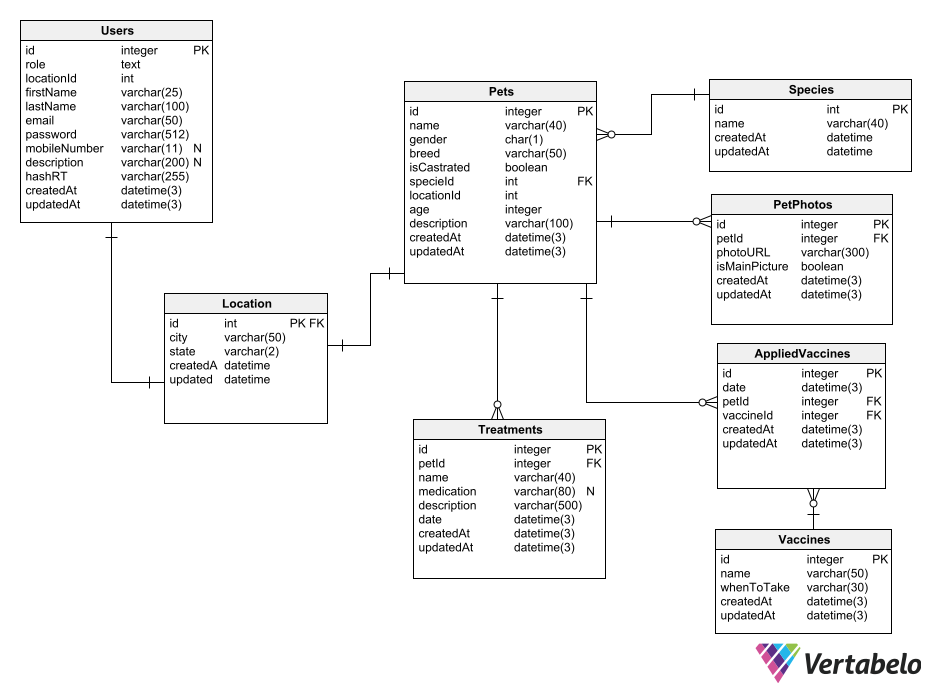

# MeuPetMinhaVida - backend

This repo contains the code for the backend of the project MeuPetMinhaVida (MyPetMyLife in portuguese), an open source system that makes it easy to find the ideal pet for you to adopt. To check out the front-end code [click here](https://github.com/otaldonuness/meupetminhavida-front).

#

This project is powered by:
- Prisma, for the database
- Planetscale, for hosting the database on the cloud
- NestJS, for dealing with incoming requests effectively 

# Current model for the database (liable to changes)

Want to contribute? All helping hands are welcome at our [discord server](https://discord.com/invite/vwZWd2ev).
